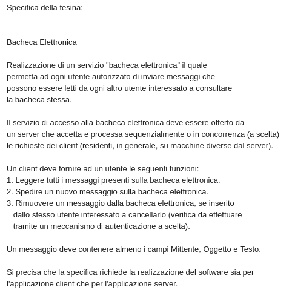

# Bacheca
> Bacheca elettronica per la gestione di annunci

Progetto realizzato come tesina per il corso di Sistemi Operativi durante l'anno accademico 2018/2019.

Le specifiche fornite dal docente sono le seguenti:



Oltre a client e server, ho realizzato un "Test_client" utile ad effettuare uno stress test del server, in quanto genererà N client 
incaricati di portare a termine M operazioni ognuno.

Per la connessione è stato utilizzato il protocollo TCP, mentre per la persistenza dei dati un database realizzato con l'ausilio
della libreria sqlite.

## Installazione

Per compilare il server utilizzare:

```sh
make install server
```
In caso non si abbia la libreria sqlite installata si può procedere alla compilazione di esse unicamente a quella del server:

```sh
make install server_sql
```
 
Per quanto riguarda il client sarà necessario digitare:

```sh
make install client
```

Per il Test_client:

```sh
make install Test_client
```

## Usage example

Di default il server si metterà a disposizione su localhost sulla porta 5195, se si desidera cambiare indirizzo IP o porta basterà
cambiarli in cima la file Server.c e ricompilare.

Per eseguire:
```sh
./server
./client
./sever_sql
./Test_client
```
## Meta

Daniele De Turris – daniele.de.turris@gmail.com

[https://github.com/DanieleDT/Bacheca](https://github.com/dbader/)
